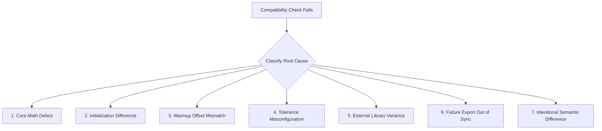

# External Compatibility Validation Skill

This skill guides the validation of `ta-crypto` indicator outputs against independent external technical analysis implementations.

---

## 1. Ground Rules & Policy Source

1. **Policy Source of Truth**: NEVER invent numerical tolerances or burn-in offsets from memory. Read [`scripts/compat-policy.json`](../../scripts/compat-policy.json) and [`references/compat-matrix-reference.md`](references/compat-matrix-reference.md).
2. **Blocking vs Non-Blocking References**:
   - `TA-Lib` (Python) and `technicalindicators` (Node.js) are **blocking checks**. CI fails if tolerances are exceeded.
   - `pandas-ta` is **non-blocking telemetry**. Environment differences or minor pandas-ta variances produce warnings, not CI failures.
3. **Golden Tests $\neq$ Compatibility Proof**:
   - Golden fixture tests (`npm run test:golden`) protect against internal regressions.
   - External compatibility scripts (`npm run test:compat`) prove alignment with industry standards.
4. **Tolerance Loosening Policy**: NEVER loosen tolerance values in `scripts/compat-policy.json` merely to make a failing test pass. Any policy change requires documented justification.

---

## 2. Failure Diagnostic Workflow

When an external compatibility check fails, follow this systematic diagnostic tree:



### Diagnostic Steps

1. **Check Fixture Freshness**: Run `npm run generate:compat` to regenerate exported vectors from current `dist/`. Re-run the comparison.
2. **Isolate First Divergent Index**: Identify the exact index where values begin to differ.
   - If values differ from index 0 to `burnIn`: Check initialization seeding (e.g. RMA seeded from SMA vs zero-filled).
   - If values differ after `burnIn`: Check core formula math, array alignment, or floating-point accumulator drift.
3. **Evaluate Burn-In Window**: Indicators with recursive smoothing (RMA in RSI/ATR/ADX, EMA in MACD) require extended burn-in to converge with external libraries. Confirm comparisons start after `burnIn` index configured in `compat-policy.json`.
4. **Distinguish Reference Libraries**: Determine whether the failure occurs in `technicalindicators` (`scripts/compare-technicalindicators.js`) or `TA-Lib` (`scripts/compare-python-refs.py`).

---

## 3. Running Compatibility Validation

### Local JS Reference Validation
```bash
npm run test:compat:technicalindicators
```

### Local Python Reference Validation (Python 3.12)
```bash
python -m pip install -r scripts/requirements-compat.txt
npm run test:compat:python
```

### Full Matrix Validation
```bash
npm run test:compat
```

---

## 4. Expanding the Compatibility Matrix

When adding a new indicator to the external compatibility matrix (tracked in [#20](https://github.com/TDamiao/ta-crypto/issues/20)):

1. Add indicator configuration to `scripts/compat-policy.json` under `indicators`:
   ```json
   "my_indicator": { "tolerance": 1e-10, "burnIn": 14 }
   ```
2. Update `scripts/export-compat-vectors.js` to export the new indicator series.
3. Update `scripts/compare-technicalindicators.js` and `scripts/compare-python-refs.py` to compare against corresponding external functions.
4. Regenerate compat vectors: `npm run generate:compat`.
5. Run full test matrix: `npm run test:compat`.
6. Update `docs/compatibility.md` matrix table.
