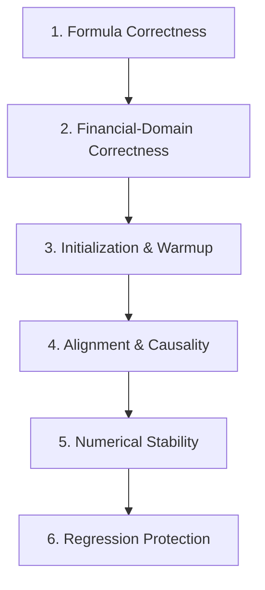

# Technical Analysis Correctness Audit Skill

This skill provides a structured methodology for auditing the mathematical and financial correctness of `ta-crypto` indicators.

---

## 1. Structured Audit Ladder

When auditing an indicator or reviewing code changes, evaluate the implementation across six sequential levels:



### Level 1: Formula Correctness
- Verify raw mathematical equations against canonical references (TA-Lib, Pine Script spec, or issue acceptance criteria).
- Check standard operators: addition vs subtraction, window boundaries, log bases (natural log $\ln$ vs $\log_{10}$).
- Read [`references/financial-invariants.md`](references/financial-invariants.md) for expected indicator formulas.

### Level 2: Financial-Domain Correctness
- **Price Domain**: Ensure prices cannot be negative or zero where mathematically undefined:
  - `logReturn`: Prices MUST be $> 0$. (See [#28](https://github.com/TDamiao/ta-crypto/issues/28)).
  - `natr`: Closing price MUST be $> 0$ to avoid division by zero or negative NATR. (See [#29](https://github.com/TDamiao/ta-crypto/issues/29)).
- **Return Compounding**: Verify return calculations (periodic vs cumulative simple returns vs log returns). (See [#27](https://github.com/TDamiao/ta-crypto/issues/27)).
- **Period Validation**: Verify `period` is a positive integer (`period > 0`). (See [#30](https://github.com/TDamiao/ta-crypto/issues/30)).

### Level 3: Initialization & Warmup Correctness
- Verify the first emitted non-null index matches the exact warmup contract.
- SMA(14): First valid output at index 13 ($N-1$).
- EMA(14): First valid output at index 13 ($N-1$), seeded by SMA of first $N$ prices.
- RSI(14): First valid output at index 14 ($N$), using $N$ price differences.
- Check that all indices before the warmup threshold strictly return `null`.

### Level 4: Alignment & Causality
- Confirm output array length exactly equals input array length ($N$).
- Check for zero-index displacement or off-by-one errors.
- Ensure causality: output index $i$ must NEVER inspect input index $j > i$.

### Level 5: Numerical Stability & Precision
- **Division by Zero**: Check every denominator (e.g., total volume in VWAP, high-low range in Stochastic, average loss in RSI). Denominators of zero must return `null`, 0, or 100 as specified by contract—never `NaN` or `Infinity`.
- **Non-Finite Propagation**: Verify that non-finite numbers (`NaN`, `Infinity`, `-Infinity`) are rejected by `assertFiniteSeries` or throw informative errors.
- **Population vs Sample Variance**: Confirm `bbands` and `realizedVolatility` use population variance ($N$), not sample variance ($N-1$).

### Level 6: Regression Protection
- Verify that every identified edge case has a unit test in `test/contracts.test.mjs` or `test/golden.test.mjs`.

---

## 2. Handling Semantic Corrections

Do NOT "fix" unexpected behavior without checking if it represents:
1. An intentional, documented public contract in `docs/`.
2. A known limitation listed in `README.md` or `docs/trust.md`.
3. A scheduled v0.4 core hardening issue (e.g., issues #27, #28, #29, #30).

If correcting a financial semantic issue (e.g., compounding in `percentReturn`):
- Refer to the open issue criteria.
- Update core math in `src/core/`.
- Update tests in `test/` and golden vectors via `npm run generate:golden`.
- Update contract documentation in `docs/indicators.md`.

---

## 3. Validation

Execute the verification commands:
```bash
npm run build
npm test
npm run test:golden
```
