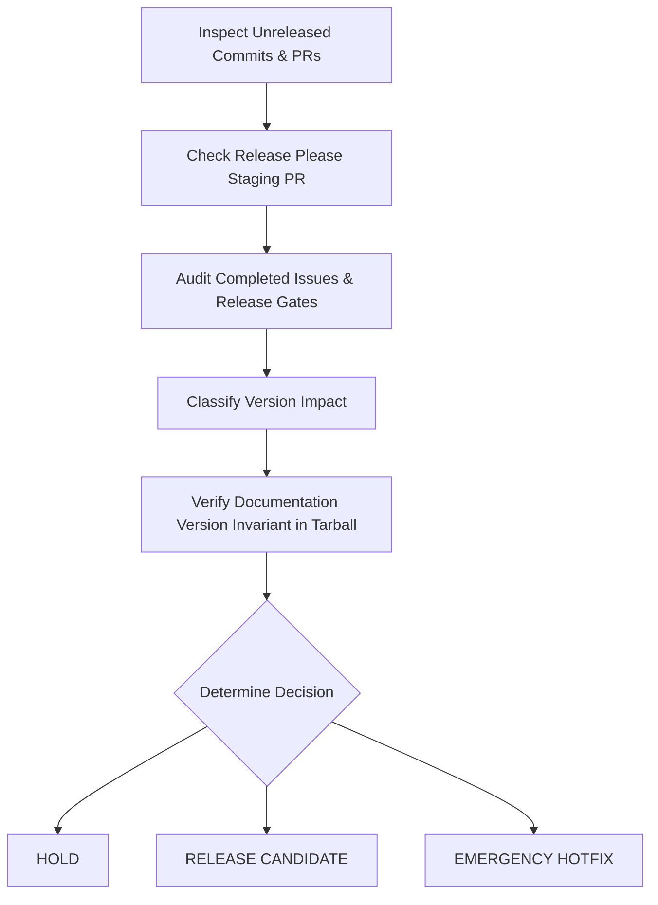

# Release Governance Skill

This skill governs release decision-making, release cadence enforcement, version classification, and release gate evaluation in `ta-crypto`.

---

## 1. Governance Principles

1. **A Merged Change Is NOT a Release**: Code merged into `main` accumulates until a coherent release candidate is formed.
2. **Weekly Cadence Limit**: Normal releases occur at most **once per week** when meaningful releasable content exists.
3. **Reference Release Policy**: All decisions MUST comply with [`docs/release-policy.md`](../../../docs/release-policy.md).
4. **Automation Authority**: Release Please and GitHub Actions are the ONLY publication authority. This skill evaluates governance eligibility—it does NOT execute local publishes or tag creation.
5. **Published Documentation Version Invariant**: Before approving or classifying any release candidate, the candidate package payload (`npm pack` tarball) must be inspected to verify that `package/README.md` and `package/package.json` declare the correct current release line or version (e.g., `v0.4` for `0.4.x`, `v0.5` for `0.5.x`, `v1.0` for `1.0.x`) and strictly contain zero obsolete prior stable release claims.

---

## 2. Release Decision Evaluation Protocol

When evaluating whether `ta-crypto` should issue a release, perform a 13-point audit:



### Audit Steps

1. **Inspect Unreleased Commits**: Run `git log` since the last tag (`<latest-tag>..HEAD`).
2. **Inspect Release Please Staging PR**: Check contents of the open Release Please PR if present.
3. **Audit Completed Issues**: Verify which open/closed issues are tied to the unreleased commits.
4. **Check Active Milestone / Release Gate**: Determine if work belongs to an active release gate issue.
5. **Inspect Public API Changes**: Identify new indicators, new stateful constructors, or signature modifications.
6. **Check Breaking Changes**: Verify whether any pre-1.0 breaking change exists (requires 6-point pre-1.0 MINOR approval).
7. **Check Correctness Fixes**: Identify financial domain or mathematical bug fixes.
8. **Inspect Compatibility Impact**: Review `compat-policy.json` and external test results.
9. **Inspect Package Payload**: Ensure no dev artifacts or source files pollute `npm pack --dry-run`.
10. **Inspect Documentation State & Version Invariant**:
    - Run `npm run docs:check` to verify internal relative links and repository consistency.
    - Run `npm pack`, inspect `package/README.md` inside the candidate `.tgz`, and verify that the declared current stable release line or version matches the candidate target version and rejects prior stable versions.
    - Run `node ./scripts/validate-release-artifact.js`.
11. **Verify CI Status**: Confirm all GitHub Actions workflows pass clean on `main`.
12. **Evaluate Release Cadence**: Check date of last release to enforce weekly cadence.
13. **Review Supply-Chain & OIDC Configuration**: Confirm GitHub Environment `npm-publish` is configured, permissions are minimal (`contents: read`, `id-token: write`), and publish job has no long-lived tokens.

---

## 3. Decision Classifications

The governance evaluation MUST output exactly one of five classifications:

### 1. `HOLD`
Return `HOLD` when:
- Unreleased commits consist only of non-releasable changes (`docs:`, `test:`, `ci:`, `chore:`, `refactor:`).
- Only a single trivial internal fix has landed.
- Active milestone work is still in progress.
- Mandatory release gate issues remain incomplete.
- Required validation or documentation invariant checks fail.
- The last release occurred less than 7 days ago and no emergency hotfix criteria apply.

*When returning `HOLD`, explicitly document what remaining items must complete before a release can occur.*

### 2. `PATCH CANDIDATE`
Returned when backward-compatible bug fixes, math corrections, documentation fixes, or performance optimizations exist and justify a release artifact (e.g. `0.4.0` $\to$ `0.4.1`).

### 3. `MINOR CANDIDATE`
Returned when new public APIs (indicators, stateful functions, crypto utilities) or approved pre-1.0 breaking corrections are ready (e.g. `0.4.0` $\to$ `0.5.0`).

### 4. `MAJOR CANDIDATE`
Returned when shipping `1.0.0` stability milestone or post-1.0 breaking changes.

### 5. `EMERGENCY HOTFIX`
Returned when a critical mathematical defect, security vulnerability, broken npm package, or severe API regression requires bypassing the weekly release cadence.

---

## 4. Structured Governance Report Template

Always format governance recommendations using this structure:

```markdown
### Release Governance Evaluation

**Decision**: [ HOLD | PATCH CANDIDATE | MINOR CANDIDATE | MAJOR CANDIDATE | EMERGENCY HOTFIX ]

#### Context & Scope
- **Last Released Version**: <resolve from latest Git tag or npm registry>
- **Proposed Target Version**: <computed by Release Please or target milestone>
- **Days Since Last Release**: [ Number ]
- **Unreleased Commits**: [ Count ]

#### Completed Issues Included
- #<issue_number> (<description>)

#### Pending / Excluded Gate Issues
- #<issue_number> (<description> - IN PROGRESS)

#### Published Documentation Version Invariant
- **Candidate Package Version**: <e.g. 0.4.1>
- **Tarball README Status**: [ VALID / INVALID ] (declares release line <e.g. v0.4>)
- **Artifact Validator**: [ PASS / FAIL ]

#### Rationale & Release Advice
[Detailed explanation of why HOLD or RELEASE is recommended]
```
