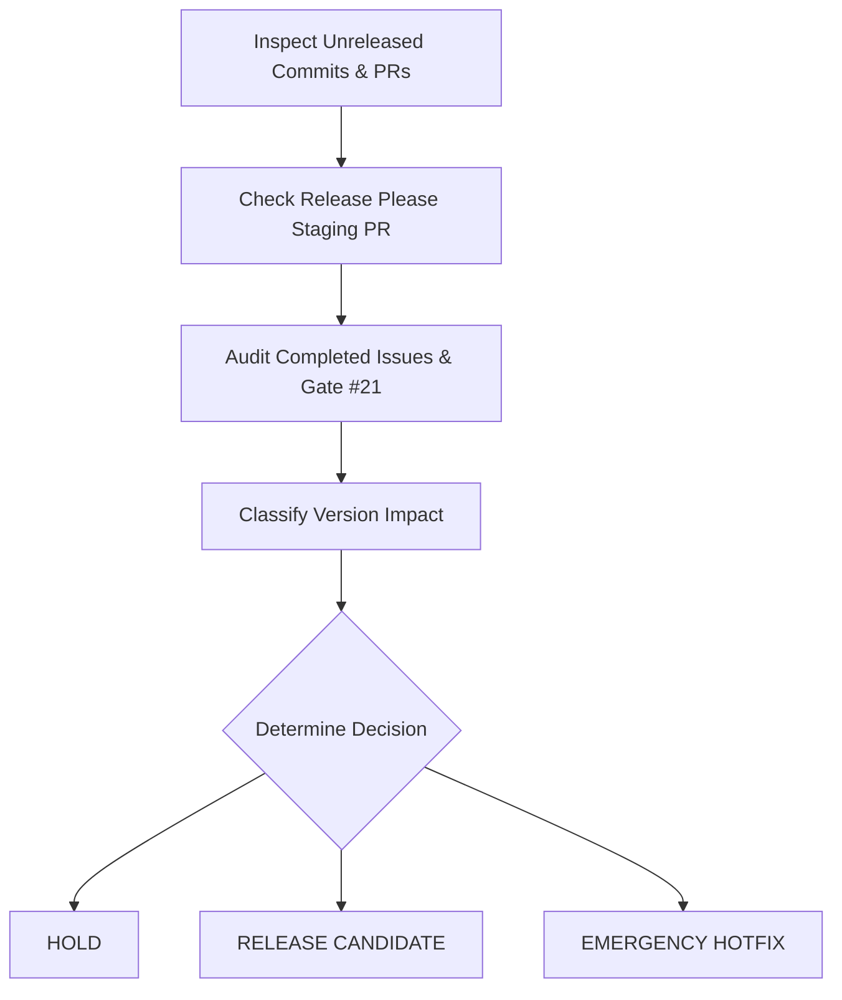

# Release Governance Skill

This skill governs release decision-making, release cadence enforcement, version classification, and release gate evaluation in `ta-crypto`.

---

## 1. Governance Principles

1. **A Merged Change Is NOT a Release**: Code merged into `main` accumulates until a coherent release candidate is formed.
2. **Weekly Cadence Limit**: Normal releases occur at most **once per week** when meaningful releasable content exists.
3. **Reference Release Policy**: All decisions MUST comply with [`docs/release-policy.md`](../../docs/release-policy.md).
4. **Automation Authority**: Release Please and GitHub Actions are the ONLY publication authority. This skill evaluates governance eligibility—it does NOT execute local publishes or tag creation.

---

## 2. Release Decision Evaluation Protocol

When evaluating whether `ta-crypto` should issue a release, perform a 12-point audit:



### Audit Steps

1. **Inspect Unreleased Commits**: Run `git log` since the last tag (e.g. `v0.3.4..HEAD`).
2. **Inspect Release Please Staging PR**: Check contents of the open Release Please PR if present.
3. **Audit Completed Issues**: Verify which open/closed issues are tied to the unreleased commits.
4. **Check Active Milestone / Release Gate**: Determine if work belongs to an active release gate issue (e.g. `v0.4` core hardening gate [#21](https://github.com/TDamiao/ta-crypto/issues/21)).
5. **Inspect Public API Changes**: Identify new indicators, new stateful constructors, or signature modifications.
6. **Check Breaking Changes**: Verify whether any pre-1.0 breaking change exists (requires 6-point pre-1.0 MINOR approval).
7. **Check Correctness Fixes**: Identify financial domain or mathematical bug fixes.
8. **Inspect Compatibility Impact**: Review `compat-policy.json` and external test results.
9. **Inspect Package Payload**: Ensure no dev artifacts or source files pollute `npm pack --dry-run`.
10. **Inspect Documentation State**: Verify `docs/` contracts and `README.md` are synchronized.
11. **Verify CI Status**: Confirm all GitHub Actions workflows pass clean on `main`.
12. **Evaluate Release Cadence**: Check date of last release to enforce weekly cadence.

---

## 3. Decision Classifications

The governance evaluation MUST output exactly one of five classifications:

### 1. `HOLD`
Return `HOLD` when:
- Unreleased commits consist only of non-releasable changes (`docs:`, `test:`, `ci:`, `chore:`, `refactor:`).
- Only a single trivial internal fix has landed.
- Active milestone work (e.g. v0.4 release gate) is still in progress.
- Mandatory release gate issues remain incomplete.
- Required validation or documentation is incomplete.
- The last release occurred less than 7 days ago and no emergency hotfix criteria apply.

*When returning `HOLD`, explicitly document what remaining items must complete before a release can occur.*

### 2. `PATCH CANDIDATE`
Returned when backward-compatible bug fixes, math corrections, or performance optimizations exist and justify a release artifact (e.g. `0.3.4` $\to$ `0.3.5`).

### 3. `MINOR CANDIDATE`
Returned when new public APIs (indicators, stateful functions, crypto utilities) or approved pre-1.0 breaking corrections are ready (e.g. `0.3.4` $\to$ `0.4.0`).

### 4. `MAJOR CANDIDATE`
Returned when shipping `1.0.0` stability milestone or post-1.0 breaking changes.

### 5. `EMERGENCY HOTFIX`
Returned when a critical mathematical defect, security vulnerability, broken npm package, or severe API regression requires bypassing the weekly release cadence.

---

## 4. Structured Governance Report Template

Always format governance recommendations using this structure:

```markdown
### Release Governance Evaluation

**Decision**: [ HOLD | PATCH CANDIDATE | MINOR CANDIDATE | MAJOR CANDIDATE | EMERGENCY HOTFIX ]

#### Context & Scope
- **Last Released Version**: v0.3.4
- **Proposed Target Version**: [ e.g. v0.4.0 ]
- **Days Since Last Release**: [ Number ]
- **Unreleased Commits**: [ Count ]

#### Completed Issues Included
- #27 (percentReturn compounding correction)
- #28 (logReturn positive price domain guard)

#### Pending / Excluded Gate Issues
- #29 (NATR close domain check - IN PROGRESS)

#### Rationale & Release Advice
[Detailed explanation of why HOLD or RELEASE is recommended]
```
