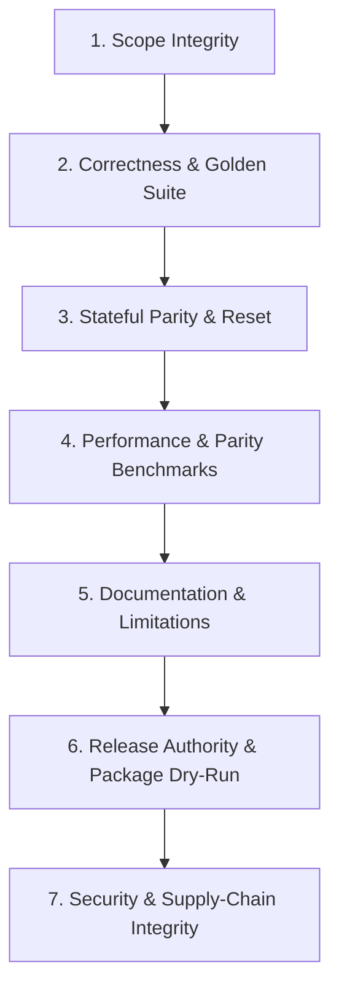

# Release Readiness Audit Skill

This skill performs technical verification to determine whether a release candidate is ready to ship.

*Note: Release cadence, version selection, and release timing are governed by [`ta-release-governance`](../ta-release-governance/SKILL.md). This skill focuses strictly on technical readiness and build integrity.*

---

## 1. Technical Readiness Criteria

A release candidate is technically ready ONLY when all 7 technical gates pass:



### Gate 1: Scope Integrity
- Release scope is explicit and matches target issues.
- All mandatory release gate issues (e.g. [#21](https://github.com/TDamiao/ta-crypto/issues/21)) for the target version are complete. Unfinished work is explicitly excluded or deferred.

### Gate 2: Mathematical Correctness & Golden Suite
- `npm test` passes all contract assertions.
- `npm run test:golden` passes clean without numerical drift (`1e-10` parity).
- External compatibility checks (`npm run test:compat:technicalindicators`) pass within policy tolerances defined in `scripts/compat-policy.json`.

### Gate 3: Stateful Parity & Reset
- Stateful indicators in `src/stateful.ts` pass streaming parity against batch APIs.
- `.reset()` behavior is verified for complete state restoration.
- Instance isolation tests pass.

### Gate 4: Performance & Parity Benchmarks
- Benchmark scripts (`npm run bench:rolling`) report ops/sec without numerical output divergence.
- Performance claims are supported by empirical benchmark logs.

### Gate 5: Documentation & Migration Notes
- `README.md` and `docs/` reflect all exported functions.
- Known limitations, warmup indices, and domain restrictions are documented.
- Breaking changes in pre-1.0 MINOR releases include migration guidance.

### Gate 6: Release Integrity & Package Packaging
- `package.json` `dependencies` is empty `{}`.
- `package.json` `exports` map correctly to `dist/`.
- `npm pack --dry-run` confirms tarball contains only `dist/`, `docs/`, `README.md`, `LICENSE`, `package.json`. No source files, agent instructions, or test scripts pollute the distribution.

### Gate 7: Security & Supply-Chain Controls
- Only active and verified security controls are documented. Do not claim npm provenance or SBOM attestations before issue [#41](https://github.com/TDamiao/ta-crypto/issues/41) is completed.

---

## 2. Readiness Classifications

The readiness report MUST classify technical status as one of:

- **`READY`**: All 7 technical gates pass clean with zero blocking issues.
- **`READY WITH NON-BLOCKING NOTES`**: All critical technical gates pass, but minor non-blocking items exist (e.g. non-blocking `pandas-ta` telemetry warnings).
- **`NOT READY`**: One or more technical gates fail, or unvalidated claims exist.

---

## 3. Execution & Reporting Protocol

Run the master verification command:
```bash
npm run release:check
```

Format the assessment output:

```markdown
### Release Readiness Technical Audit

**Status**: [ READY | READY WITH NON-BLOCKING NOTES | NOT READY ]

#### Gate Checklist
- [ ] 1. Scope Integrity: [ PASS | FAIL ]
- [ ] 2. Correctness & Golden Suite (`npm test && npm run test:golden`): [ PASS | FAIL ]
- [ ] 3. External Compatibility (`npm run test:compat:technicalindicators`): [ PASS | FAIL ]
- [ ] 4. Stateful Parity & Reset: [ PASS | FAIL ]
- [ ] 5. Performance & Parity Benchmarks (`npm run bench:rolling`): [ PASS | FAIL ]
- [ ] 6. Documentation & Limitations Sync: [ PASS | FAIL ]
- [ ] 7. Package Packaging Dry-Run (`npm pack --dry-run`): [ PASS | FAIL ]

#### Findings & Evidence
- **Blocking Finding 1**: [Concrete evidence log or file location]
- **Non-Blocking Note 1**: [Description]

#### Recommendation
[Instructions to resolve blocking findings before merging Release Please PR]
```
